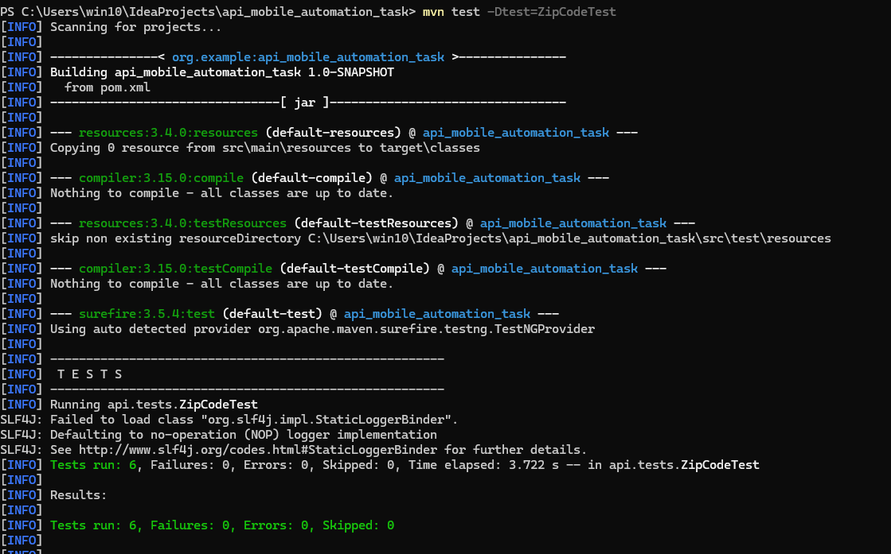
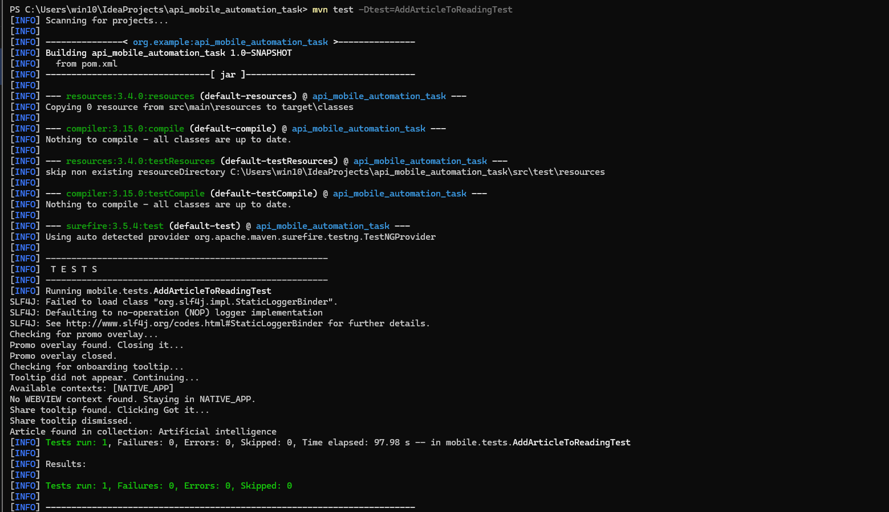

# API & Mobile Automation Technical Task

Automation project developed in Java to demonstrate API testing and mobile UI automation.

## Tech Stack

- Java 19
- Maven
- TestNG
- REST Assured
- Appium Java Client
- Selenium WebDriver
- Android
- UiAutomator2
- Page Object Model (POM)

---
## Project Structure

```text
src
└── test
    └── java
        ├── api
        │   ├── base
        │   │   └── BaseApiTest.java
        │   └── tests
        │       └── ZipCodeTest.java
        │
        └── mobile
            ├── base
            │   ├── BaseMobileTest.java
            │   └── BasePage.java
            │
            ├── pages
            │   ├── ArticlePage.java
            │   ├── CollectionDetailPage.java
            │   ├── CollectionPickerPage.java
            │   ├── CollectionsPage.java
            │   ├── OnboardingPage.java
            │   └── SearchPage.java
            │
            └── tests
                └── AddArticleToReadingTest.java

pom.xml
README.md
```
---

# Task 1 – API Automation

## Application

Zippopotam.us API

## Endpoint

GET /{country}/{postalCode}

## Test Coverage

### Positive Scenarios

- Valid US postal code returns HTTP 200
- Response content type is JSON
- Response data is validated against expected values

### Negative Scenarios

- Invalid postal code
- Invalid country code
- Empty country code
- Empty postal code

The API tests use REST Assured for request handling and TestNG for test execution and assertions.

---

# Task 2 – Mobile Automation

## Application

Wikipedia Android App

## Scenario

Save an Article to a Reading List

## Automated Flow

1. Launch Wikipedia
2. Skip onboarding
3. Search for "Artificial intelligence"
4. Open the article
5. Verify that the article is displayed
6. Save the article
7. Create a new Reading List
8. Navigate to the Saved / Collections section
9. Search for the created Reading List
10. Open the Reading List
11. Verify that "Artificial intelligence" is displayed in the collection

---

# Automation Approach

The mobile automation follows the Page Object Model (POM) design pattern.

The framework includes:

- Reusable BasePage utilities
- BaseMobileTest for Appium driver setup and teardown
- Dedicated Page Objects for application screens
- Explicit waits
- Meaningful TestNG assertions
- Android resource-id based locators where applicable

The API automation uses a reusable BaseApiTest to configure the REST Assured request specification.

---

# Prerequisites

Before running the project, install and configure:

- Java JDK 19
- Maven
- Android Studio
- Android SDK
- Android Emulator or Android device
- Node.js and npm
- Appium
- UiAutomator2 driver
- Wikipedia Android application

---

# Setup

## 1. Clone the Repository

git clone https://github.com/SalmaHoss/api_mobile_test_automation.git

cd api_mobile_automation_task

## 2. Verify Java

java -version

The project is configured for Java 19.

## 3. Verify Maven

mvn -version

## 4. Install Appium

npm install -g appium

Install the UiAutomator2 driver:

appium driver install uiautomator2

## 5. Start an Android Emulator

Start an Android emulator using Android Studio.

Verify the connected device:

adb devices

## 6. Start Appium Server

appium

The mobile tests use the default Appium server URL:

http://127.0.0.1:4723/

---

# Running the Tests

## Run All Tests

mvn test

## Run API Tests Only

mvn test -Dtest=ZipCodeTest

## Run Mobile Tests Only

mvn test -Dtest=AddArticleToReadingTest

---

# Mobile Configuration

The mobile test configuration supports overriding the device name and Appium server URL using Java system properties.

Default device name:

Pixel 7

Default Appium URL:

http://127.0.0.1:4723/

Example:

mvn test -Dtest=AddArticleToReadingTest -DdeviceName="Pixel 7"

The Appium server URL can also be overridden:

mvn test -Dtest=AddArticleToReadingTest -DappiumUrl="http://127.0.0.1:4723/"

---

# Test Automation Practices

The project demonstrates the following automation practices:

- Page Object Model
- Reusable base classes
- Explicit waits
- Maintainable locators
- Separation of test logic from page implementation
- Meaningful assertions
- Positive and negative API test coverage
- Maven-based test execution

The implementation is focused on the scenarios provided in the technical task while keeping the framework maintainable and extensible.

---


---
# Author

Salma Hossam

QA & Automation Test Engineer | ISTQB Certified